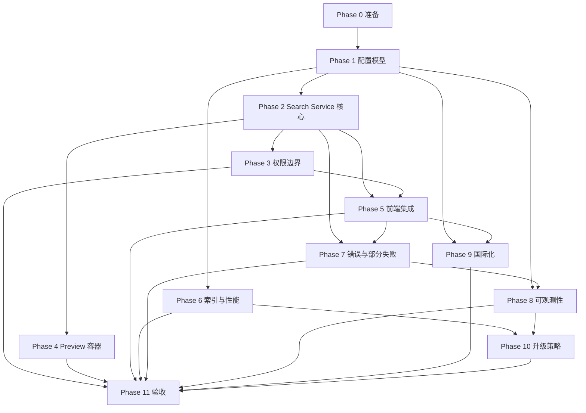

# Global Search Implementation Plan

## 1. 文档信息

| 项 | 内容 |
|---|---|
| 文档名 | IMPLEMENTATION_PLAN_global_search |
| 版本 | v0.1 |
| 状态 | Draft |
| 模块名 | `wd_global_search` |
| 目标 | 按冻结 TDD 将 Global Search 的配置、搜索、权限、Preview、性能和验收能力实施为可交付模块 |
| 评审状态 | 待 Implementation Plan 评审 |
| 计划基准日期 | 2026-10-03 |

### 1.1 上游输入

- SRS：[SRS_global_search.md](../requirement/SRS_global_search.md) V1.4 FROZEN；
- RAR：[RAR_global_search.md](../requirement/RAR_global_search.md) V0.2；
- Spike：[SPIKE_global_search_report.md](../verification/SPIKE_global_search_report.md)；
- TV：[TV_global_search_report.md](../verification/TV_global_search_report.md)；
- TDD：[TDD_global_search.md](../design/TDD_global_search.md) V0.3 FROZEN，已获批准冻结。

## 2. 实现目标与范围

### 2.1 实现目标

在不引入外部搜索引擎、LLM 或向量检索的前提下，交付遵守当前用户 Odoo 权限、支持可配置 Business Resource、可审计发布、可复现错误协议和只读 Preview 的 Global Search 模块。

### 2.2 In Scope

- Odoo 配置模型、ACL、校验、版本生命周期和审计；
- Search Service 及 Effective Conditions、Result Identity、计数和错误协议；
- 当前用户权限、字段权限、Relation Path 和失败关闭；
- Search Workspace、Query Understanding、Refinement、计数和 Snapshot；
- 真实 Form View 的只读 Preview；
- B-tree、`text_pattern_ops`、GIN `gin_trgm_ops` 索引策略及迁移/回滚；
- 可观测性、国际化、migration 和验收回归；
- TV-01/02/03/05/06 未完成项的补测。

### 2.3 Out of Scope

- Elasticsearch、OpenSearch、LLM、向量检索；
- 修改 `odoo/` 或官方 addons；
- 使用 `sudo()` 绕过业务权限；
- DDD 聚合、实体和值对象设计；
- SRS 明确标记为 V1 OUT 的否定条件、任意布尔表达式等；
- 未经需求变更批准的新增业务资源或业务语义。

### 2.4 与 TDD 的边界关系

TDD 已冻结架构、接口、权限边界、配置逻辑模型、索引策略和错误协议。本计划只定义实现顺序、交付物、依赖、资源和验收，不重新定义这些技术决策。任何实现中发现的技术边界冲突必须回到 TDD 变更流程。

### 2.5 与 SRS 的边界关系

SRS V1.4 是行为和验收的唯一需求基准。本计划不降低 MUST 要求，不把 TV 的“有条件通过”改写为完全通过；未验证项必须保留为实施验收门槛或后续 TV。

## 3. 前置条件

| 前置条件 | 状态/要求 | 责任 |
|---|---|---|
| TDD Freeze | 已批准冻结，实施前确认仓库版本为 V0.3 | 技术负责人 |
| SRS Freeze | V1.4 FROZEN | 产品/需求负责人 |
| Odoo 环境 | Odoo 18、Python 3.11+、PostgreSQL 15+ | 环境负责人 |
| 测试数据库 | 独立功能测试库已准备 | QA/环境负责人 |
| 权限 fixture | TV-04 多公司、多用户、Portal、字段权限 fixture 可复用 | QA |
| 性能环境 | 8 核/16 GiB/SSD 的隔离环境，支持百万级补测 | 性能负责人 |
| 配置管理员组 | 配置管理员角色和 ACL 已定义 | 安全/产品负责人 |
| 浏览器环境 | Chrome、Firefox、Safari 最新版及桌面/窄屏 | QA |
| PostgreSQL 扩展 | `pg_trgm` 可在隔离库启用 | DBA/环境负责人 |
| CI | Python、XML、JS、ORM、浏览器测试命令可运行 | CI 负责人 |

如果任一 P0 前置条件不满足，只能继续执行不依赖该条件的准备工作，不得将整体里程碑标记为完成。

## 4. 实现阶段与里程碑

### Phase 0：准备

**目标**

建立不修改官方代码的 Odoo 模块骨架、依赖、目录和基础 ACL。

**交付物**

- `wd_global_search` 模块 manifest 和目录结构；
- 基础依赖声明；
- 配置管理员组和最小 ACL；
- 模块加载、升级和卸载说明；
- Implementation 分支的 CI 基线。

**验收标准**

- 模块可安装、升级、卸载；
- 不修改 `odoo/` 或官方 addons；
- 模块依赖可在隔离数据库解析；
- 基础 ACL 不赋予业务数据越权；
- 代码检查和最小 ORM smoke 通过。

**依赖**：TDD Freeze、Odoo 环境。  
**预计工作量**：3 人日。  
**风险**：模块依赖或 ACL 设计错误。  
**缓解/应急**：先在空数据库安装；失败时只回滚模块骨架，不进入后续 Phase。

### Phase 1：配置模型

**目标**

按 TDD §4、§5、§11 实现配置模型、权限、校验和 Published 快照边界。

**交付物**

- Configuration Domain；
- Configuration Version；
- Business Resource；
- Resource Model Mapping；
- Searchable Field；
- Relation Path；
- Business Date Mapping；
- State Mapping；
- Snapshot Field；
- Vocabulary Entry；
- Entity / Scoring Config；
- Performance Config；
- Audit Event；
- 配置模型 ACL 和 Record Rule；
- 配置校验约束；
- Draft/Validating/Published/Retired/Rejected 生命周期；
- 发布校验、1 MB 快照上限和 checksum；
- Published 版本缓存失效接口；
- 配置管理员操作说明。

**验收标准**

- 配置管理员可创建和修改 Draft；
- 普通用户不能直接读取配置模型或修改版本；
- 无效模型、字段、Relation Path、索引策略、优先级和 Business Date 被拒绝；
- 发布失败保留 Draft、标记 REJECTED、记录原因且不影响当前 Published；
- 同一配置域只能有一个 Published 版本；
- Published 不允许原地修改；
- 快照 JSON canonical 化、checksum 和大小限制生效；
- 发布、停用、校验失败和缓存失效均形成 Audit Event；
- 不使用 `sudo()` 读取业务数据。

**依赖**：Phase 0。  
**预计工作量**：12 人日。  
**风险**：配置关系过于复杂导致发布校验遗漏。  
**缓解/应急**：先实现校验清单的逐项失败证据；发现边界冲突时暂停发布并提交 TDD 变更。

### Phase 2：Search Service 核心

**目标**

按 TDD §3、§9、§10 实现从请求到结果聚合的核心服务，不含完整前端。

**交付物**

- HTTP/RPC Facade；
- Facade 创建的 UserContext；
- Condition Merger；
- Configuration Provider；
- Permission Boundary 接口；
- Resource Executor；
- Result Identity Deduplicator；
- Counter Aggregator；
- Error / Partial Success Aggregator；
- Search Service 编排；
- 服务端 request_id；
- 超时、取消、并发控制、分页和签名 cursor；
- 服务端限流。

**验收标准**

- UserContext 只由 Facade 从当前 `request.env` 创建；
- Search Service 不直接读取 HTTP 全局上下文；
- Parsed/Refinement 合并结果符合 BR-007、BR-008、BR-010；
- Result Identity 按 `(business_resource_key, technical_model, record_id)` 去重；
- 分页发生在去重和稳定排序之后，计数不受分页影响；
- cursor 绑定配置、条件、用户上下文和排序版本，并能验证签名/过期；
- 单资源超时不丢弃已完成资源；
- 总超时返回已完成结果和 `TIMEOUT`；
- cancel 只允许当前用户取消自己的 request_id；
- 超过并发/队列/速率限制返回 `RATE_LIMITED`；
- 配置错误、权限边界异常和协议错误失败关闭。

**依赖**：Phase 1。  
**预计工作量**：18 人日。  
**风险**：并行资源执行和 ORM 事务边界影响稳定性。  
**缓解/应急**：先串行正确性，再启用受控并发；超时和取消保留 request 级审计。

### Phase 3：权限边界

**目标**

按 TDD §6 将当前用户、字段、Record Rule、Relation Path 和失败关闭固化为 Search Service 的不可绕过边界。

**交付物**

- 当前用户 Resource 执行上下文；
- 资源读取权限过滤；
- 每跳 Relation Path 权限过滤；
- Searchable Field 权限过滤；
- 硬安全边界生成和校验；
- 权限异常分类；
- TV-04 fixture 自动化回归；
- 权限审计字段。

**验收标准**

- TV-04 十类场景全部通过；
- 不使用 `sudo()` 搜索、计数或 Preview；
- 无权记录不出现在结果、计数、Snapshot 或错误细节；
- 无权字段不参与搜索；
- Group Rule OR/AND 不被隐式假设；
- 权限异常返回 `PERMISSION_DENIED` 并失败关闭；
- 每次权限变化使用新的当前用户环境即可生效。

**依赖**：Phase 1、Phase 2。  
**预计工作量**：10 人日。  
**风险**：Odoo 规则组合造成隐蔽泄露。  
**缓解/应急**：硬边界 fixture 作为合并门禁；任何泄露立即阻断后续 Phase。

### Phase 4：Preview 容器

**目标**

按 TDD §7 将真实 Form View 读取包装为不可写的 Preview 容器。

**交付物**

- Form View 当前用户加载；
- 当前用户记录读取；
- 字段权限过滤；
- 按钮、编辑、保存、删除、Chatter、附件、活动的双层阻断；
- `PERMISSION_OR_DELETED` 安全状态；
- 桌面分栏和窄屏单栏；
- Chrome/Firefox/Safari 浏览器回归脚本和证据。

**验收标准**

- 三个目标模型真实 Form View 可加载；
- Preview 不调用业务写 API；
- 无权字段不返回；
- 记录删除或权限变化统一进入安全状态；
- 切换记录保留 Raw Query 和 Refinement；
- 桌面/375px 窄屏布局符合 TDD；
- 三浏览器控制台无错误、无写 RPC；
- TV-05 隔离库和权限变化补测通过。

**依赖**：Phase 2、Phase 3。  
**预计工作量**：12 人日。  
**风险**：官方 Form View 按钮或继承 View 注入写操作。  
**缓解/应急**：容器层隐藏加服务端只读 API；任何未知动作默认拒绝。

### Phase 5：前端集成

**目标**

交付 Search Workspace 的用户流程和结构化搜索结果展示。

**交付物**

- Search Workspace UI；
- Query Understanding 展示；
- Refinement 维度；
- Snapshot 展示；
- 结果和分类计数；
- 无结果状态；
- `PARTIAL_SUCCESS`、`TIMEOUT`、`FAILED` 状态；
- 打开完整记录；
- 键盘操作；
- 窄屏降级；
- 前端 UI Test Contract。

**验收标准**

- Raw Query、Effective Conditions、Refinement 状态可区分；
- 同维度多值显示为 OR，不同维度显示为 AND；
- 计数与去重后的 Result Identity 一致；
- 部分成功不隐藏成功结果；
- 权限/配置错误不显示不可信计数；
- Preview 记录切换状态正确；
- 关键操作具备稳定语义 selector；
- 桌面和窄屏完成浏览器验收。

**依赖**：Phase 2、Phase 4。  
**预计工作量**：18 人日。  
**风险**：前端状态与服务端错误协议不一致。  
**缓解/应急**：以 TDD 返回结构为契约；协议不一致时阻断合并。

### Phase 6：索引与性能

**目标**

按 TDD §8 实现索引策略、迁移/回滚并完成 NFR-001 补测。

**交付物**

- Exact Identifier B-tree；
- Prefix `text_pattern_ops`；
- Selective Contains GIN `gin_trgm_ops`；
- GiST 的显式选择条件；
- 索引迁移和回滚脚本；
- 百万级隔离性能数据；
- 冷缓存/热缓存对照；
- 20 并发 P95/P99 结果；
- Record Rule 额外开销对照。

**验收标准**

- 索引策略与字段用途配置一致；
- 高选择率查询允许 Seq Scan；
- 迁移失败可恢复旧策略；
- 百万级首次结果 P95 ≤ 2 秒；
- 百万级完整结果 P95 ≤ 5 秒；
- 20 并发错误率 ≤ 1%；
- 冷缓存/热缓存均有结果；
- 性能结果有 EXPLAIN、索引大小和写入影响证据。

**依赖**：Phase 1、Phase 2；隔离性能环境。  
**预计工作量**：15 人日，不含数据生成等待。  
**风险**：百万级或冷缓存不达标。  
**缓解/应急**：先定位选择率、索引、ORM、权限或并发瓶颈；不擅自引入外部搜索引擎，必要时提交 NFR/范围变更。

### Phase 7：错误与部分失败

**目标**

按 TDD §9 将所有错误状态、错误码、计数和提示接入服务及前端。

**交付物**

- `SUCCESS`、`PARTIAL_SUCCESS`、`FAILED`、`TIMEOUT`；
- `PERMISSION_DENIED`、`CONFIGURATION_ERROR`、`CONFIGURATION_TOO_LARGE`、`RATE_LIMITED`；
- retryable 规则；
- 已完成结果保留；
- 错误提示文案；
- TV-06 真实服务层回归。

**验收标准**

- `TIMEOUT`、`RATE_LIMITED` 的 retryable 为 true；
- 权限、配置、协议/内部错误 retryable 为 false；
- 部分失败计数只包含成功资源；
- 配置错误返回 0 结果并失败关闭；
- 权限错误不泄露记录存在性；
- TV-06 语义在真实 Search Service 通过；
- 浏览器显示状态、提示和计数一致。

**依赖**：Phase 2、Phase 3、Phase 5。  
**预计工作量**：8 人日。  
**风险**：异常被包装为成功或静默丢失。  
**缓解/应急**：所有资源 outcome 必须显式归类；未分类异常统一失败关闭。

### Phase 8：可观测性

**目标**

实现 TDD §3.12、§5.4 的性能、错误、行为 hash 和配置审计。

**交付物**

- request_id/config_version；
- Resource latency/result count；
- error rate/error code；
- `raw_query_hash`、`conditions_hash`；
- 配置发布/拒绝/停用审计；
- 结构化日志；
- 指标和告警说明。

**验收标准**

- 不记录原始查询、字段值或业务数据；
- hash 使用服务端 salt；
- 指标按 Resource、配置版本和错误码可聚合；
- 配置失败、发布、停用和缓存失效均可审计；
- 审计和指标不改变业务权限边界；
- 性能和错误率可在验收环境采集。

**依赖**：Phase 1、Phase 2、Phase 7。  
**预计工作量**：6 人日。  
**风险**：日志泄露业务数据或指标过量。  
**缓解/应急**：字段白名单和脱敏门禁；发现泄露立即停止采集并清理日志。

### Phase 9：国际化

**目标**

实现 Vocabulary、Snapshot、错误提示、日期和时间的用户语言/时区行为。

**交付物**

- Vocabulary 翻译；
- Snapshot 标签翻译；
- 错误消息翻译；
- 日期格式化；
- 用户时区转换；
- 缺失翻译英文回退。

**验收标准**

- `en_US`/`zh_CN` 周起始符合 BR-009.1；
- DateTime 按用户时区转换；
- 错误码稳定、消息可翻译；
- 缺失翻译不阻断搜索；
- TV-06 时间语义回归通过。

**依赖**：Phase 1、Phase 2、Phase 5、Phase 7。  
**预计工作量**：6 人日。  
**风险**：服务语言和浏览器语言不一致。  
**缓解/应急**：以 `request.env.user.lang` 为唯一服务语言来源，前端只展示服务返回标签。

### Phase 10：升级策略

**目标**

交付配置、数据和索引的可执行升级、备份、验证和回滚流程。

**交付物**

- `mymodules/wd_global_search/migrations/` migration；
- 配置模型迁移；
- 索引迁移；
- 必要数据迁移；
- 升级前备份清单；
- 升级后验证清单；
- 回滚方案。

**验收标准**

- migration 遵循 Odoo 版本机制；
- 旧配置可读或明确进入 REJECTED；
- 索引迁移失败可恢复；
- 升级前后 ACL、Published 版本和 checksum 正确；
- 隔离数据库完整执行升级和回滚演练；
- 不修改官方 addons。

**依赖**：Phase 1、Phase 6、Phase 8。  
**预计工作量**：8 人日。  
**风险**：迁移不可逆或配置丢失。  
**缓解/应急**：强制备份和演练；未通过回滚演练不得发布。

### Phase 11：验收

**目标**

基于 SRS、TDD 和 TV 完成最终验收、补测和交付。

**交付物**

- SRS 验收矩阵；
- TDD 技术边界验收矩阵；
- TV 补测结果；
- Chrome/Firefox/Safari 证据；
- 性能、权限、错误和 Preview 报告；
- 发布候选版本；
- 最终验收报告。

**验收标准**

- MUST 需求全部有通过证据或获批准的变更；
- SHOULD 需求有验收结果；
- OUT 需求明确未实现；
- NFR-001/NFR-002 未验证项完成或形成批准的范围决定；
- TV-04 无泄露、TV-05 浏览器、TV-06 服务层回归通过；
- 文档、代码、migration、配置和测试可复现。

**依赖**：Phase 0–10。  
**预计工作量**：10 人日。  
**风险**：跨层问题在最后阶段集中暴露。  
**缓解/应急**：每个 Phase 设置门禁，禁止把未完成项累积到最终验收。

## 5. 实现顺序与依赖

### 5.1 Phase 依赖图



### 5.2 关键路径

```text
P0 -> P1 -> P2 -> P3 -> P5 -> P7 -> P8 -> P10 -> P11
```

性能路径为：

```text
P0 -> P1 -> P2 -> P6 -> P11
```

### 5.3 可并行工作

- Phase 3 权限边界和 Phase 6 索引准备可在 Phase 2 核心接口稳定后并行；
- Phase 4 Preview 和 Phase 5 前端可在 Search Service 只读契约稳定后并行；
- Phase 8 可观测性可与 Phase 7 错误协议并行，但必须共享错误码；
- Phase 9 国际化可与前端集成并行；
- Phase 10 必须等待配置模型和索引结构达到可迁移状态。

并行不意味着绕过依赖；跨 Phase 接口变更必须经过评审。

## 6. 里程碑

| 里程碑 | 内容 | 验收标准 | 预计完成 |
|---|---|---|---|
| M1 | 配置模型完成 | 配置模型、ACL、校验和生命周期门禁通过 | 第 3 周 |
| M2 | Search Service 核心完成 | Conditions、Result Identity、计数、分页和超时单元/集成门禁通过 | 第 6 周 |
| M3 | 权限边界完成 | TV-04 十类 fixture 回归通过 | 第 8 周 |
| M4 | Preview 容器完成 | 隔离库、Chrome/Firefox/Safari Preview 回归通过 | 第 10 周 |
| M5 | 前端集成完成 | Search Workspace、Refinement、计数和状态可用 | 第 12 周 |
| M6 | 索引与性能完成 | NFR-001 百万级、冷/热缓存、20 并发验收通过或有批准结论 | 第 15 周 |
| M7 | 错误与部分失败完成 | TV-06 真实服务层和浏览器提示回归通过 | 第 16 周 |
| M8 | 可观测性完成 | 性能、错误、hash 和审计指标可采集 | 第 17 周 |
| M9 | 国际化完成 | 多语言、时区和日期验收通过 | 第 18 周 |
| M10 | 升级策略完成 | migration、索引迁移、备份和回滚演练通过 | 第 19 周 |
| M11 | 验收完成 | SRS/TDD/TV 矩阵全部关闭或有批准变更 | 第 21 周 |

预计总工期：21 周；包含约 2 周环境、性能数据和最终回归缓冲。

## 7. 验收标准

### 7.1 SRS 验收

- 每条 MUST 需求映射到实现、测试和证据；
- 每条 SHOULD 需求有通过、延期或批准不实现结论；
- 每条 OUT 需求在验收矩阵中明确不实现；
- FR-L1/L2/L3、FR-RF、FR-SW、FR-PM、FR-ER 均有对应阶段和验收证据；
- BR、CFG、NFR、CON 需求不得只以代码存在作为通过依据。

### 7.2 TDD 验收

- §3 Search Service：接口、条件合并、权限、计数、超时和限流可验证；
- §4 配置模型：所有配置模型、字段用途、校验和 ACL 可验证；
- §5 配置版本：REJECTED/Published、缓存失效、审计和多 worker 可验证；
- §6 权限：当前用户、字段、每跳关系和失败关闭可验证；
- §7 Preview：Form View、只读、错误状态、布局和浏览器可验证；
- §8 索引：策略、计划、迁移和回滚可验证；
- §9 错误：状态、错误码、retryable、部分结果和计数可验证；
- §10 接口：请求/响应、request_id、cancel、Preview 参数可验证；
- §11 数据模型：ACL、升级和版本兼容可验证；
- §12 测试策略：测试层次和隔离规则被实际执行。

### 7.3 TV 补测

- TV-01：百万级/资源、冷缓存、Record Rule 额外开销；
- TV-02：百万级、冷/热缓存、索引迁移/回滚；
- TV-03：配置发布、停用、多 worker 即时生效；
- TV-05：隔离库、Firefox、Safari、运行时权限变化；
- TV-06：真实 Search Service、错误提示、计数和超时。

### 7.4 性能验收

- 首次结果 P95 ≤ 2 秒；
- 完整结果 P95 ≤ 5 秒；
- 20 并发错误率 ≤ 1%；
- 冷缓存和热缓存均有对照；
- 性能环境、数据规模、索引和 Record Rule 均记录；
- 失败时必须提供瓶颈分析，不得静默放宽阈值。

### 7.5 权限验收

- TV-04 十类 fixture 全部通过；
- 无记录泄露、无计数泄露、无字段泄露；
- Relation Path 每跳应用 Record Rule；
- 权限异常失败关闭；
- 字段权限排除；
- 不使用 `sudo()` 绕过业务权限。

### 7.6 浏览器验收

- Chrome、Firefox、Safari；
- 桌面和窄屏；
- `res.partner`、`sale.order`、`stock.picking`；
- 只读、保存、按钮、Chatter、附件、活动；
- 删除/权限变化；
- 记录切换；
- 键盘、控制台和 RPC；
- 部分成功、超时和配置错误状态。

## 8. 风险与缓解

| 风险 | 类型 | 概率 | 影响 | 缓解措施 | 应急方案 |
|---|---|---:|---:|---|---|
| 百万级 NFR-001 不达标 | 技术 | 中 | 高 | Phase 6 先做容量探针和索引选择率测量 | 提交 NFR/范围变更；不擅自引入外部引擎 |
| 权限边界泄露 | 技术 | 中 | 严重 | TV-04 fixture 作为合并门禁，每跳 Record Rule 回归 | 立即停止发布，回滚到上一 Published 配置 |
| Preview 触发写操作 | 技术 | 低 | 严重 | 容器隐藏 + 服务端只读 API + RPC 监控 | 禁用 Preview 路由并回滚 |
| 配置缓存失效失败 | 技术 | 中 | 高 | 版本/checksum 校验、多 worker 验证 | 暂停发布，强制失效并恢复旧 Published |
| 索引迁移失败 | 技术 | 中 | 高 | 隔离库、迁移前备份、回滚脚本 | 删除新索引，恢复旧索引策略 |
| 人力不足 | 资源 | 中 | 中 | 关键路径优先，Phase 之间并行 | 延后非关键国际化/报告工作，不降低安全门禁 |
| 性能环境不足 | 资源 | 中 | 高 | 提前锁定隔离性能主机和数据窗口 | 保留 100k 条件结论，NFR-001 不关闭 |
| TDD 变更 | 依赖 | 低 | 高 | 变更必须经评审并更新追溯矩阵 | 暂停受影响 Phase，重估计划 |
| SRS 变更 | 依赖 | 低 | 高 | 需求变更需版本化和验收影响分析 | 回退到已批准基线 |
| TV 补测依赖环境 | 依赖 | 中 | 中 | Phase 0 建立环境 readiness gate | 标记未验证，不宣称通过 |
| Odoo 版本升级 | 外部 | 低 | 高 | 固定 Odoo 18，升级前做兼容性评估 | 锁定版本并延迟升级 |
| PostgreSQL 版本升级 | 外部 | 低 | 中 | 索引/计划回归和扩展版本记录 | 维持已验证版本 |
| 浏览器版本升级 | 外部 | 中 | 中 | 固定验收版本并保留回归矩阵 | 标记兼容性待补，不关闭 Preview |

## 9. 资源计划

### 9.1 人力

| 角色 | 人数 | 预计投入 |
|---|---:|---:|
| Odoo 后端工程师 | 1 | 100% |
| 前端/OWL 工程师 | 1 | 60%（Phase 4/5/7/9） |
| QA/E2E 工程师 | 1 | 60%（Phase 3/4/7/11） |
| 性能/数据库工程师 | 1 | 25%（Phase 6/10） |
| 安全/权限评审 | 1 | 10%（Phase 1/3/11） |
| 产品/需求评审 | 1 | 按里程碑投入 |

### 9.2 环境

- 开发环境：Odoo 18、本地模块路径、最小演示数据；
- 功能测试环境：独立数据库、TV-04 权限 fixture；
- 性能环境：8 核/16 GiB/SSD、PostgreSQL 15+、百万级数据；
- 浏览器环境：Chrome、Firefox、Safari 最新版；
- 隔离发布环境：用于 migration、索引迁移和回滚演练。

### 9.3 数据

- 配置数据：多 Resource、复合 Resource、Vocabulary、评分和性能配置；
- 功能数据：固定标记、边界日期、多个状态和关联路径；
- 权限数据：多公司、共享记录、Portal、字段 ACL、复杂 Record Rule；
- 性能数据：10 个逻辑资源、百万级目标；
- 所有业务 fixture 通过 ORM 创建和清理。

### 9.4 工具

- Odoo ORM/测试框架；
- Python 单元和集成测试；
- Playwright 浏览器 E2E；
- PostgreSQL `pg_trgm` 和计划证据工具，仅限隔离性能环境；
- CI、结构化日志、指标和审计查看工具。

## 10. 时间计划

| 阶段 | 工期 | 时间窗口 | 备注 |
|---|---:|---|---|
| Phase 0 | 1 周 | 第 1 周 | 准备和门禁 |
| Phase 1 | 2 周 | 第 2–3 周 | 配置模型和发布 |
| Phase 2 | 3 周 | 第 4–6 周 | Search Service 核心 |
| Phase 3 | 2 周 | 第 7–8 周 | 权限边界 |
| Phase 4 | 2 周 | 第 9–10 周 | Preview |
| Phase 5 | 2 周 | 第 11–12 周 | 前端集成 |
| Phase 6 | 3 周 | 第 13–15 周 | 性能和索引 |
| Phase 7 | 1 周 | 第 16 周 | 错误与部分失败 |
| Phase 8 | 1 周 | 第 17 周 | 可观测性 |
| Phase 9 | 1 周 | 第 18 周 | 国际化 |
| Phase 10 | 1 周 | 第 19 周 | 升级策略 |
| 缓冲 | 1 周 | 第 20 周 | 环境/缺陷缓冲 |
| Phase 11 | 1 周 | 第 21 周 | 最终验收 |

总工期：预计 21 周。实际日期以 Phase 0 环境 readiness 和人员到位日期为准。

## 11. 质量保证

- 所有代码经过至少一名后端/前端同行评审；
- 配置模型、Condition Merger、权限边界、错误聚合和 Result Identity 设单元覆盖率门禁；
- 关键配置/搜索/权限路径设 ORM 集成测试；
- Search Workspace 和 Preview 设 Playwright E2E；
- 目标单元测试覆盖率：核心服务和配置校验 ≥ 90%；
- 目标集成测试覆盖率：关键业务路径 ≥ 80%；
- 每个 Phase 完成后执行最小回归，不将缺陷积累到 Phase 11；
- 性能测试使用独立数据库和固定数据版本；
- 权限测试验证结果、计数、字段、Preview 和错误提示；
- migration 先备份、再隔离执行、再回滚演练；
- 所有验收证据包含命令、环境、数据规模、结果和路径。

## 12. 变更管理

### 12.1 TDD 变更

发现实现需要修改技术边界时，必须：

1. 提交变更说明和影响的 TDD 章节；
2. 评估 SRS、TV、接口、数据和验收影响；
3. 通过技术评审；
4. 更新 TDD 版本和追溯矩阵；
5. 重新批准后才继续受影响 Phase。

### 12.2 SRS 变更

SRS 变更必须由需求负责人批准并增加版本。Implementation Plan 不得自行修改 SRS；变更后需重新评估 TV 和里程碑。

### 12.3 配置变更

- Draft 配置变更不影响当前 Published；
- 发布必须通过校验、生成版本、checksum 和审计；
- Published 不原地编辑；
- 失败发布进入 REJECTED；
- 变更后执行配置、权限和缓存失效回归。

### 12.4 索引变更

- 索引策略变更必须有性能数据；
- 先在隔离数据库迁移；
- 记录旧/新计划、大小、构建和写入影响；
- 生产迁移前提供回滚方案；
- 不以单次热缓存结果替代容量结论。

## 13. 交付物

### 13.1 代码

- `mymodules/wd_global_search/` 模块；
- 配置模型、Search Service、Facade、权限边界；
- Preview 容器和 Search Workspace；
- 索引迁移与回滚；
- migration scripts；
- 可观测性和审计。

### 13.2 测试

- 单元测试；
- ORM 集成和权限测试；
- 配置生命周期测试；
- 性能和索引测试；
- Playwright 浏览器测试；
- migration/回滚测试；
- 回归测试报告。

### 13.3 文档和证据

- 模块 README 和运行说明；
- 配置管理员说明；
- API/错误协议说明；
- 部署和升级说明；
- TV 补测报告；
- SRS/TDD/Implementation Plan 追溯矩阵；
- 性能计划、截图、日志和审计证据。

## 14. 未解决问题

### 14.1 Implementation TODO

- 选择 Odoo bus/版本检查的具体缓存失效实现；
- 选择资源并行的具体 worker/队列实现；
- 明确最终错误文案和翻译文件；
- 确定配置管理员菜单和操作流程；
- 确定 cursor 具体编码库和密钥轮换接入方式；
- 明确指标后端和日志保留配置。

这些 TODO 不得改变 TDD 已冻结的行为和安全边界。

### 14.2 后续 TV

- TV-01/02 百万级和冷缓存；
- TV-03 配置发布、停用、多 worker；
- TV-05 隔离库、Firefox、Safari、运行时权限变化；
- TV-06 真实服务层和浏览器错误状态。

## 15. 与 TDD 的追溯矩阵

| TDD 章节 | Implementation Phase | 验收标准 |
|---|---|---|
| §3 Search Service | Phase 2、7、8 | 接口、条件、超时、限流、错误和指标通过 |
| §4 配置模型 | Phase 1 | 所有配置模型、ACL、字段和校验通过 |
| §5 配置版本 | Phase 1、8、10 | 生命周期、发布、缓存失效、审计和迁移通过 |
| §6 权限边界 | Phase 3 | TV-04 十类 fixture 无泄露且失败关闭 |
| §7 Preview 容器 | Phase 4、5 | 三模型、三浏览器、桌面/窄屏和权限变化通过 |
| §8 索引策略 | Phase 6、10 | 策略、计划、迁移、回滚和 NFR-001 通过 |
| §9 错误与部分失败 | Phase 7 | 状态、错误码、retryable、计数和提示通过 |
| §10 接口定义 | Phase 2、5 | Search、cancel、Preview、配置 API 契约通过 |
| §11 数据模型 | Phase 1、10 | Odoo 模型、ACL、升级兼容和回滚通过 |
| §12 测试策略 | Phase 11 | 单元、ORM、性能、权限和浏览器矩阵完成 |

## 16. 与 SRS 的追溯矩阵

| SRS 需求 | Implementation Phase | 验收标准 |
|---|---|---|
| FR-L1 | Phase 2、6 | Identifier 搜索正确，百万级 P95 达标 |
| FR-L2 | Phase 2、6 | Entity/关系搜索遵守权限和性能阈值 |
| FR-L3 | Phase 2、5、9 | 自然语言条件、时间和 Vocabulary 行为通过 |
| FR-RF | Phase 2、5 | Refinement、日期、状态、计数和排序通过 |
| FR-SW | Phase 4、5 | Workspace、Preview、窄屏和键盘通过 |
| FR-PM | Phase 3 | 记录/字段/关系/运行时权限无泄露 |
| FR-ER | Phase 7、8 | 错误状态、部分失败、超时、审计通过 |
| BR-001~BR-005 | Phase 1、2、5 | Business Resource、复合资源和排序通过 |
| BR-006~BR-013 | Phase 2、3、5、7 | 条件、权限、去重、计数和错误协议通过 |
| BR-014~BR-015 | Phase 1、8、10 | 生命周期、校验、审计和发布通过 |
| CFG-001~CFG-004 | Phase 1 | Resource、Field、Snapshot、Vocabulary 配置通过 |
| CFG-006~CFG-007 | Phase 1、8 | Entity/版本/发布配置通过 |
| CFG-010 | Phase 1、2 | 评分阈值、权重和候选上限生效 |
| CFG-011 | Phase 1、6、10 | 索引策略、性能、迁移和回滚通过 |
| CFG-012~CFG-013 | Phase 1、2 | Entity/Performance 配置边界通过 |
| NFR-001 | Phase 6 | P95 首次 ≤2 秒、完整 ≤5 秒、错误率 ≤1% |
| NFR-002 | Phase 1、8、11 | 业务和配置新鲜度、无需重启生效 |
| AC-044~AC-045 | Phase 1、8、11 | 业务提交可见、配置发布即时生效 |
| CON-008 | Phase 3、7 | 权限异常失败关闭 |
| CON-009 | Phase 4 | Preview 无编辑和业务副作用 |
| CON-010 | Phase 1、8 | 配置发布无需重启生效 |
| CON-011 | Phase 3 | 无权限字段不参与搜索 |

## 17. 变更历史

| 版本 | 日期 | 变更 |
|---|---|---|
| v0.1 | 2026-10-03 | 基于 SRS V1.4、Spike、TV-01~06 和 TDD v0.3 FROZEN 起草实施计划 |
